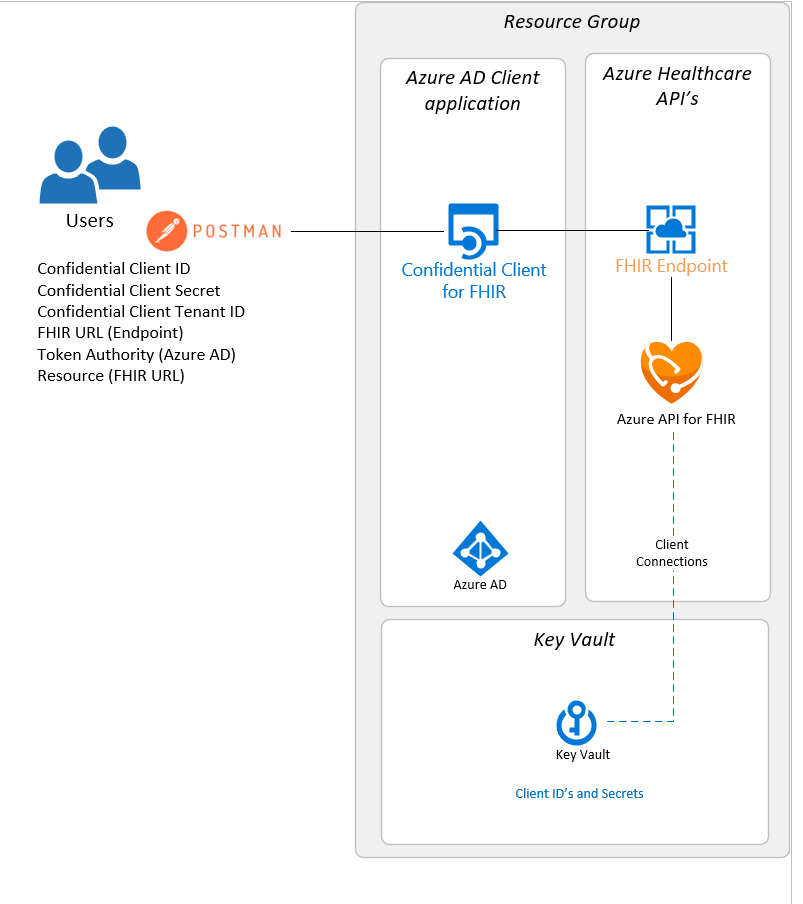

# FHIR-Starter

## Introduction 

The goal of the **FHIR-Starter** repo is to provide users with a choice of deployment options for [Azure API for FHIR](https://docs.microsoft.com/en-us/azure/healthcare-apis/azure-api-for-fhir/overview) and supporting resources. The `deployFhirStarter.bash` script hosted in this repo is the recommended method for deploying Azure API for FHIR with an [AAD Service Client](https://docs.microsoft.com/en-us/azure/healthcare-apis/azure-api-for-fhir/register-confidential-azure-ad-client-app) for use with FHIR-Proxy.

## Script details
The following Azure resources will be deployed when you run the `deployFhirStarter.bash` script. Detailed deployment instructions are available in the [scripts](./scripts) directory.

1) Azure API for FHIR  
2) Azure Key Vault (users can select to use an existing Key Vault as long as the Key Vault's [Purge Protection](https://docs.microsoft.com/en-us/azure/key-vault/general/soft-delete-overview#:~:text=Purge%20protection%20is%20an%20optional,the%20retention%20period%20has%20passed.) is disabled)
3) Azure AD Service Principal for RBAC ([link](https://docs.microsoft.com/en-us/cli/azure/create-an-azure-service-principal-azure-cli))
4) Azure Resource Group

## Postman setup
After running the `deployFhirStarter.bash` script, you can set up Postman following [these instructions](https://github.com/microsoft/fhir-starter/blob/main/docs/postman.md).

---

## Deployed Components  

---
__Note:__ The `deployFhirStarter.bash` script is designed and tested for the [Azure Cloud Shell - Bash Shell](https://docs.microsoft.com/en-us/azure/cloud-shell/overview) environment. 

## Deployment
To deploy resources in Azure, you must have an active Azure Subscription. Read [here](https://azure.microsoft.com/en-us/free/) about obtaining a free Azure Subscription. For instructions on getting started with Azure API for FHIR deployment, please visit the [scripts](./scripts) directory in this repo. 

__Next Steps__  
Complete the deployment and setup steps detailed **[here](./scripts)**.

## Tracking Changes & Updates
We continue to monitor questions, feature requests, and of course, bugs/issues. You can review the issues list [here](https://github.com/microsoft/fhir-starter/issues).

If you are interested in receiving notifications when we publish updates then please click the `Watch` button (top right) to follow this repo. 

## Resources
Below are some references that might be useful for the reader.

* [Azure for the healthcare industry](https://azure.microsoft.com/en-us/industries/healthcare/)
* [Azure API for FHIR](https://azure.microsoft.com/en-us/services/azure-api-for-fhir/)
* [Microsoft Cloud for Healthcare](https://www.microsoft.com/en-us/industry/health/microsoft-cloud-for-healthcare)

## Repository Contents 

The table below lists items contained within this repository:

Directory       | Contains                                                
----------------|--------------------------------------------------
main            | Readme, Security and compliance documents 
docs            | Getting started documents  
scripts         | Readme + Deployment, Setup, and Control scripts  
templates       | ARM Templates for customers without Cloud Shell access (__in progress__)

---

## Contributing

This project welcomes contributions and suggestions.  Most contributions require you to agree to a
Contributor License Agreement (CLA) declaring that you have the right to, and actually do, grant us
the rights to use your contribution. For details, visit https://cla.opensource.microsoft.com.

When you submit a pull request, a CLA bot will automatically determine whether you need to provide
a CLA and decorate the PR appropriately (e.g., status check, comment). Simply follow the instructions
provided by the bot. You will only need to do this once across all repos using our CLA.

This project has adopted the [Microsoft Open Source Code of Conduct](https://opensource.microsoft.com/codeofconduct/).
For more information see the [Code of Conduct FAQ](https://opensource.microsoft.com/codeofconduct/faq/) or
contact [opencode@microsoft.com](mailto:opencode@microsoft.com) with any additional questions or comments.

## Trademarks

This project may contain trademarks or logos for projects, products, or services. Authorized use of Microsoft 
trademarks or logos is subject to and must follow 
[Microsoft's Trademark & Brand Guidelines](https://www.microsoft.com/en-us/legal/intellectualproperty/trademarks/usage/general).
Use of Microsoft trademarks or logos in modified versions of this project must not cause confusion or imply Microsoft sponsorship.
Any use of third-party trademarks or logos are subject to those third-party's policies.
